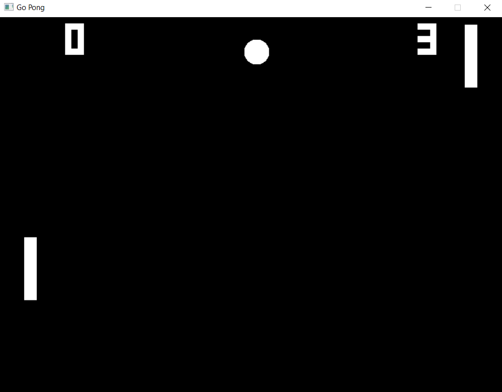

# Go Pong
The original pong game made with Go.



## How to play
1. Play with up and down arrows.
2. To start new round press `Space`. 
3. whoever gets the first 5 pints wins.
4. A perfect AI (It never loses 😂).
   
## Requirements
* [SDL2](http://libsdl.org/download-2.0.php)

Below is some commands that can be used to install the required packages in
some Linux distributions. Some older versions of the distributions such as
Ubuntu 13.10 may also be used but it may miss an optional package such as
_libsdl2-ttf-dev_ on Ubuntu 13.10's case which is available in Ubuntu 14.04.

On __Ubuntu 14.04 and above__, type:\
`apt install libsdl2{,-image,-mixer,-ttf,-gfx}-dev`

On __Fedora 25 and above__, type:\
`yum install SDL2{,_image,_mixer,_ttf,_gfx}-devel`

On __Arch Linux__, type:\
`pacman -S sdl2{,_image,_mixer,_ttf,_gfx}`

On __Gentoo__, type:\
`emerge -av libsdl2 sdl2-{image,mixer,ttf,gfx}`

On __macOS__, install SDL2 via [Homebrew](http://brew.sh) like so:\
`brew install sdl2{,_image,_mixer,_ttf,_gfx} pkg-config`

On __Windows__,
1. Install mingw-w64 from [Mingw-builds](http://mingw-w64.org/doku.php/download/mingw-builds)
    * Destination Folder: Select a folder that your Windows user owns
2. Install SDL2 http://libsdl.org/download-2.0.php
    * Extract the SDL2 folder from the archive using a tool like [7zip](http://7-zip.org)
    * Inside the folder, copy the `i686-w64-mingw32` and/or `x86_64-w64-mingw32` depending on the architecture you chose into your mingw-w64 folder e.g. `C:\Program Files\mingw-w64\x86_64-6.3.0-win32-seh-rt_v5-rev1\mingw64`
3. Setup Path environment variable
    * Put your mingw-w64 binaries location into your system Path environment variable. e.g. `C:\Program Files\mingw-w64\x86_64-6.3.0-win32-seh-rt_v5-rev1\mingw64\bin` and `C:\Program Files\mingw-w64\x86_64-6.3.0-win32-seh-rt_v5-rev1\mingw64\x86_64-w64-mingw32\bin`

## Installation and Running the game locally

### 1. Clone the Repo
```bash
git clone https://github.com/mdfaizan7/go-pong.git
```

### 2. cd into the folder
```bash
cd go-pong
```

### 3. Run the game
```bash
go run main.go
```

